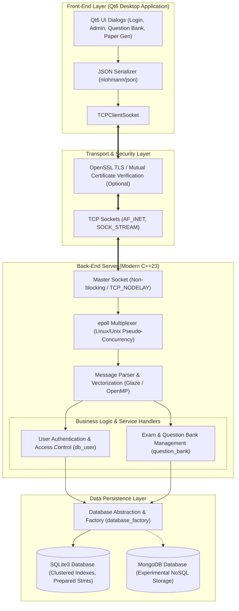
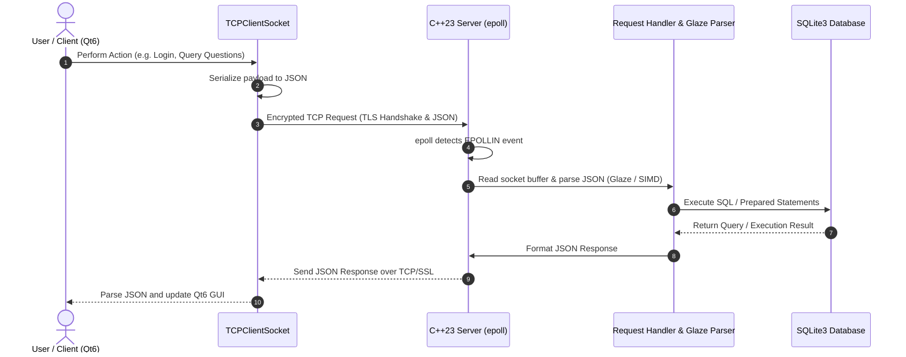

# CPlusPlus General Management System

[](https://github.com/SuperbTUM/CPlusPlus_General_Management_System/actions/workflows/ci.yml)
[](https://en.cppreference.com/w/cpp/20)
[](https://gcc.gnu.org/)
[](Dockerfile)

## Introduction

We developed a complicated full stack application with socket-based single-server-multi-client connection. The front-end of this application is window-based Qt6 and back-end is SQLite3/MongoDB(experimental). Serveral highlights of this application are:

* Modern **C++23**
* Multiplexing with epoll (unix-based system only) to achieve pseudo-concurrency
* Multi-threading & vectorization
* A variety of database selection
* API for user customization


## Goal & Vision

The aim of this full-stack application is to provide a smooth and robust (high scalability & low latency) user experience while maintaining low memory occupation at the same time. We leveraged unix-domain socket(We don't wish to use asio at this stage as we don't want to have boost library involved.) and epoll connection to achieve faster pseudo-concurrency and lots of move(forward) operations to avoid unnecessary copy and reduce memory cost. We applied vectorization to process messages faster. We explicitly added clustered indexes in our relational database to achieve faster queries.

Other than performance, we also take safety into consideration. We had pragma key credentials in the database to avoid sensitive information leakage. We also had encrypted TCP connection with digital certificate and private key verification. 


## System Architecture



### Communication Flow



### Architectural Highlights

1. **Client Tier (Front-End):**
   - Built with **Qt6** providing an interactive desktop interface (Admin, Teacher, and Student workflows).
   - Encapsulates socket communications in `TCPClientSocket` exchanging structured JSON data.
2. **Transport & Security Tier:**
   - Dual-mode TCP socket networking supporting raw or **OpenSSL TLS**-encrypted communication with mutual CA certificate and private key validation.
3. **Server Tier (Back-End):**
   - Engineered in **C++23** utilizing an `epoll` event loop for efficient non-blocking I/O multiplexing.
   - Accelerated JSON processing using `glaze` and SIMD/OpenMP vectorization.
   - Modularized service controllers separating authentication ([`db_user`](Back-end/user_info.hpp)) and question management ([`question_bank`](Back-end/question_bank.hpp)).
4. **Data Persistence Tier:**
   - Abstracted interface via [`database_factory`](Back-end/database.hpp) and [`database`](Back-end/database.hpp).
   - Core relational persistence with **SQLite3** with clustered indexes, prepared statements, and optional pragma encryption.
   - Pluggable NoSQL persistence support with **MongoDB**.


## Dependencies & Requirements

* CMake 3.25
* g++-14! [Installation](https://askubuntu.com/questions/1513160/how-to-install-gcc-14-on-ubuntu-22-04-and-24-04#1518433)
* Ninja (Optional)

* String formatting tool: [fmt](https://github.com/fmtlib/fmt)
* JSON formatting tool: [json](https://github.com/nlohmann/json), [glaze(faster)](https://github.com/stephenberry/glaze)
* Database: Install with `sudo apt-get install libsqlite3-dev`, and optionally, [SQLite3 Encryption](https://github.com/rindeal/SQLite3-Encryption) (Only accessible on Windows system, MSVC)
* Parallelism: [openmp](https://www.openmp.org/resources/)
* Security: Install with `sudo apt install libssl-dev`


## Quick Start

In the front-end part, install Qt6 on your local operating system, navigate to front-end directory compile with cmake.

In the back-end part, compile server with CMakeLists.txt.

If you are working with Ninja, execute the following commands:

```bash
cmake -G Ninja
ninja
```

Otherwise,

```bash
cmake CMakeLists.txt
make
```

You can also make it work in docker environment:

```bash
docker build .
```

If activate without openssl, on the server side,

```bash
cd bin/
./cplusplusproject2022fall
```

On the client side, after compiled with C++20,

```bash
./client_unencrypted.cpp SERVER_IP
```

If activate with openssl (after quick modification on the CMakeLists.txt), additionally, you need CA certificate and private key,

```bash
cd bin/
./cplusplusproject2022fall PATH_TO_CA_CERTIFICATE PATH_TO_UNSECURED_PRIVATE_KEY
```

On the client side, after compiled with C++20,

```bash
./client.cpp SERVER_IP PATH_TO_CA_CERTIFICATE PATH_TO_UNSECURED_PRIVATE_KEY
```

OpenSSL sample certificates and private keys [Drive](https://drive.google.com/drive/folders/1Wyv4MbbxnDLL1HnFAtIpSDIo4SmZEaGw?usp=sharing)


## Testing & Verification

The project includes unit test suites and automated end-to-end network integration tests:

### 1. Modern C++ Feature Tests (C++20 / C++23)
Tests three-way comparisons (`operator<=>`), `std::ranges`/`std::views`, `std::expected` monadic database operations, `std::jthread`/`std::stop_token`, and OpenSSL 3.0 SHA-256 password encryption:

```bash
cd Back-end/build
./bin/modern_cpp_test
```

### 2. End-to-End Client-Server Integration Test
Runs an automated test that spins up the server in a `std::jthread` on an ephemeral port, connects a TCP client socket, executes user registration, SHA-256 authenticated login, subject creation, and query commands over JSON, and shuts down cooperatively via `stop_token`:

```bash
cd Back-end/build
./bin/e2e_network_test
```


## Memory Check with Valgrind

To install Valgrind, please follow the steps
```bash
wget https://sourceware.org/pub/valgrind/valgrind-3.20.0.tar.bz2
tar xvf valgrind-3.20.0.tar.bz2
cd valgrind-3.20.0
./configure
make
sudo make install
```

Or
```bash
sudo snap install valgrind --classic
```

For memcheck
```bash
cd bin/
valgrind --leak-check=full --show-leak-kinds=all --track-origins=yes --verbose ./cplusplusproject2022fall
```


## Benchmark

| System    | CPU    | Round Trip Time (Example data, nano-scale) |
| --------- | ------ | ------------------------------------------ |
| Ubuntu 20 | 4-core | 88.16 ms                                   |


## Part of C++ new features

* **C++20 Coroutines (`co_await`, `co_yield`)**: Zero-overhead lazy asynchronous task model (`async::Task<T>`) for asynchronous command dispatching, and streaming coroutine generator (`async::Generator<T>`) for lazy SQLite database record streaming.
* **C++20 Concurrency Primitives**: `std::jthread` with RAII auto-join and cooperative cancellation (`std::stop_token`), alongside reader-writer locking via `std::shared_mutex` and `std::shared_lock`.
* **C++20 Three-Way Comparison (`operator<=>`)**: Defaulted spaceship comparison operators on model structs (`UserInfo`, `QuestionInfo`, `s1`).
* **C++20 Ranges & Views (`std::ranges`, `std::views`)**: Composable declarative transformations on collections, message payloads, and coroutine streams.
* **C++23 `std::expected`**: Monadic error handling (`.and_then()`, `.transform()`, `.value_or()`) replacing legacy sentinel error codes.
* **C++23 `<print>`**: Native type-safe formatting with `std::print` and `std::println`.
* **OpenSSL 3.0 Cryptography**: Upgraded to standard EVP digest API (`EVP_Q_digest`) using SHA-256 password hashing.
* **Concept & Requires & Template Constraints**: Static polymorphism with `hashable` and type traits.
* **Automated Modern Test Suites**: Dedicated unit tests ([`test_modern_cpp.cpp`](Back-end/test_modern_cpp.cpp)) and full network integration tests ([`test_e2e.cpp`](Back-end/test_e2e.cpp)).
* Vectorization & SIMD via OpenMP
* Structured binding, Variant & Optional, Smart pointers, Constexpr, Final


## Acknowledge

We thank the assistance and guidance from Prof. [Bjarne Stroustrup](https://www.stroustrup.com/).